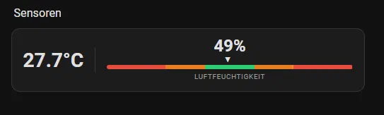
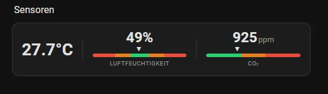

# Sensor Card

A compact Home Assistant Lovelace card for temperature, humidity, and optional CO₂ monitoring — with a color-coded range bar and visual editor.

## Screenshots

### Temperature & Humidity


### With CO₂


## Features

- 🌡️ Temperature display with one decimal place
- 💧 Humidity with color-coded range bar and live pointer
- 🌿 Optional CO₂ block (expands card automatically)
- 🎨 Fully adapts to your Home Assistant theme
- ⚙️ Built-in visual editor — no YAML required
- 📐 Configurable good ranges per sensor

## Installation

### HACS (recommended)

1. Open HACS → Frontend
2. Click the three-dot menu → **Custom repositories**
3. Add `https://github.com/Nellyskills/sensor-card` → Category: **Dashboard**
4. Search for **Sensor Card** and install
5. Reload your browser

### Manual

1. Download `sensor-card.js` from the [latest release](https://github.com/Nellyskills/sensor-card/releases/latest)
2. Copy it to `config/www/sensor-card.js`
3. Go to **Settings → Dashboards → Resources** and add:
   ```
   URL: /local/sensor-card.js
   Type: JavaScript Module
   ```
4. Hard reload your browser (Ctrl+Shift+R)

## Usage

Add the card via the visual editor or paste YAML manually.

### Minimal config

```yaml
type: custom:sensor-card
temperature: sensor.my_temperature
humidity: sensor.my_humidity
```

### With CO₂ and custom ranges

```yaml
type: custom:sensor-card
temperature: sensor.my_temperature
humidity: sensor.my_humidity
humidity_good_min: 40
humidity_good_max: 60
co2: sensor.my_co2
co2_good_min: 400
co2_good_max: 800
```

## Configuration

| Option | Required | Default | Description |
|--------|----------|---------|-------------|
| `temperature` | ✅ | — | Temperature sensor entity |
| `humidity` | ✅ | — | Humidity sensor entity |
| `humidity_good_min` | ❌ | `40` | Lower bound of green range (%) |
| `humidity_good_max` | ❌ | `60` | Upper bound of green range (%) |
| `humidity_min` | ❌ | `0` | Bar scale minimum (%) |
| `humidity_max` | ❌ | `100` | Bar scale maximum (%) |
| `co2` | ❌ | — | CO₂ sensor entity — enables CO₂ block |
| `co2_good_min` | ❌ | `400` | Lower bound of green range (ppm) |
| `co2_good_max` | ❌ | `800` | Upper bound of green range (ppm) |
| `co2_min` | ❌ | `400` | Bar scale minimum (ppm) |
| `co2_max` | ❌ | `2000` | Bar scale maximum (ppm) |

## License

MIT © [Nellyskills](https://github.com/Nellyskills)
